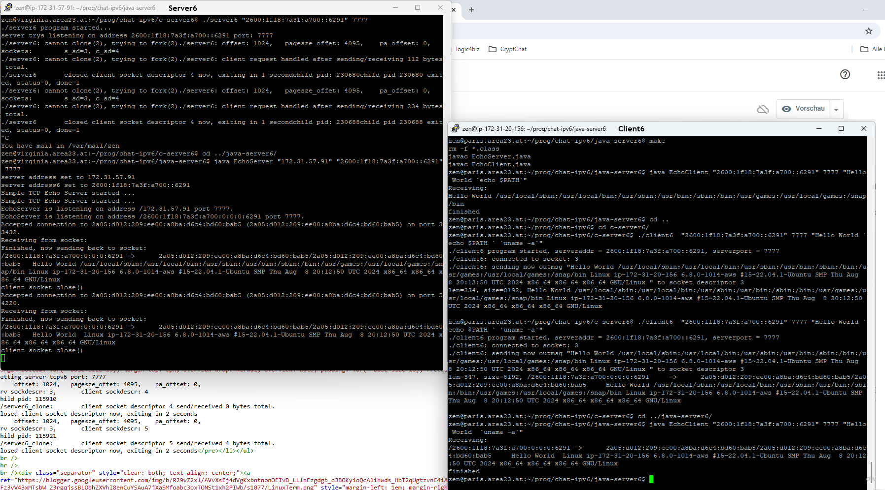

# cloning-ipv6-server

is same as a forking ipv6 server, but using clone(2) for posix threads instead of fork (copying entire process image).

<b>currently only availible for linux / unix and gcc</b>.

## build project

client6.s and server6_clone.s can be compiled and linked with <b>GNU make utility</b> by using existing Makefile.

- change directory to source and Makefile containing directory server6-clone.
  <pre>cd server6-clone/
  </pre>

Now clean project to delete outdated binary executables or objects.

- <b>make clean</b>
  <pre>rm -f client6 client6.o server6_clone server6_clone.o
  </pre>
  
## build client6

- make client6
  <pre>gcc "-Wimplicit-function-declaration" -o client6.o -c  client6.c
  client6.c: In function ‘main’:
  client6.c:33:5: warning: implicit declaration of function ‘close’; did you mean ‘pclose’? [-Wimplicit-function-declaration]
    33 |     close(s);
       |     ^~~~~
       |     pclose
  gcc "-Wimplicit-function-declaration" -o client6 client6.o</pre>

## build server6_clone

- make server6_clone
  <pre>fcc  "-Wimplicit-function-declaration" -o server6_clone.o -c server6_clone.c
  server6_clone.c: In function ‘childFunc’: 
  server6_clone.c:61:27: warning: implicit declaration of function ‘handle_client’ [-Wimplicit-function-declaration] 
  61 |                 bytesum = handle_client(c);     /* received bytes got from handle client socket */ 
     |                           ^~~~~~~~~~~~~<
  gcc "-Wimplicit-function-declaration"  -o server6_clone server6_clone.o </pre>

## start server at a custom tcpv6 port

- ./server6_clone 7777
  <pre>received arguments: argv[1} = 7777,
  setting server tcpv6 port: 7777
     offset: 1024,   pagesze_offet: 4095,    pa_offset: 0,
  srv sockdescr: 3,       client sockdescr: 4
  child pid: 115910
  ./server6_clone:        client socket descriptor 4 send/received 0 bytes total.
  closed client socket descriptor now, exiting in 2 seconds
     offset: 1024,   pagesze_offet: 4095,    pa_offset: 0,
  srv sockdescr: 3,       client sockdescr: 5
  child pid: 115921
  ./server6_clone:        client socket descriptor 5 send/received 4 bytes total.</pre>

clos
