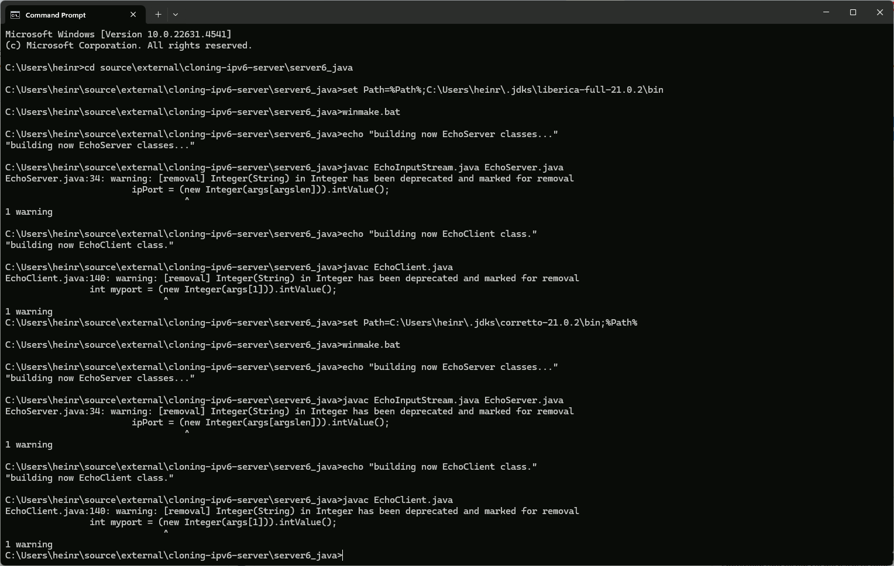

# **C** *a cloning ipv6 socket server & client*

is same as a forking ipv6 server, but using clone(2) for posix threads instead of fork (copying entire process image).

<b>currently only availible for linux / unix and gcc</b>.

## build c sources with gcc under linux

client6.s and server6_clone.s will be compiled and linked with **gcc** and ***GNU make utility***.

- change directory to c sources containing directory c-server6 and then make clean:
  <pre>cd c-server6/
  <b>make clean</b>
  rm -f client6 client6.o server6_clone server6_clone.o
  </pre>
  
## build client6

- make client6
  <pre>gcc "-Wimplicit-function-declaration" -o client6.o -c  client6.c
client6.c: In function ‘ping’:
client6.c:42:27: warning: embedded ‘\0’ in format [-Wformat-contains-nul]
   42 |     sprintf(inbuf, "%s\r\n\0", msg);
      |                           ^~
client6.c:49:16: warning: function returns address of local variable [-Wreturn-local-addr]
   49 |         return &outbuf[0];
      |                ^~~~~~~~~~
client6.c: In function ‘main’:
client6.c:92:17: warning: implicit declaration of function ‘close’; did you mean ‘pclose’? [-Wimplicit-function-declaration]
   92 |                 close(sd);
      |                 ^~~~~
      |                 pclose
gcc "-Wimplicit-function-declaration" -o client6 client6.o</pre>

## build server6

- make server6
  <pre>gcc  "-Wimplicit-function-declaration" -o server6.o -c server6.c
gcc "-Wimplicit-function-declaration"  -o server6 server6.o</pre>

## start server at a custom tcpv6 port

- ./server6 7777
  <pre>zen@virginia.area23.at:~/prog/chat-ipv6/c-server6$ ./server6 "2600:1f18:7a3f:a700::6291" 7777
./server6 program started...
server trys listening on address 2600:1f18:7a3f:a700::6291 port: 7777
./server6: cannot clone(2), trying to fork(2)./server6: offset: 1024,   pagesze_offet: 4095,    pa_offset: 0,
sockets:        s_sd=3, c_sd=4
./server6: cannot clone(2), trying to fork(2)./server6: client request handled after sending/receiving 136 bytes total.
./server6       closed client socket descriptor 4 now, exiting in 1 secondchild pid: 231095child pid 231095 exited, status=0, done=1
^C
zen@virginia.area23.at:~/prog/chat-ipv6/c-server6$ sudo ./server6 "2600:1f18:7a3f:a700::6291" 7777
./server6 program started...
server trys listening on address 2600:1f18:7a3f:a700::6291 port: 7777
./server6:      offset: 1024,   pagesze_offet: 4095,    pa_offset: 0,
sockets:        s_sd=3, c_sd=4
./server6:      client request handled after sending/receiving 136 bytes total.
child pid: 231102child pid 231102 exited, status=0, done=1
./server6:      offset: 1024,   pagesze_offet: 4095,    pa_offset: 0,
sockets:        s_sd=3, c_sd=5
./server6:      client request handled after sending/receiving 135 bytes total.
child pid: 231107child pid 231107 exited, status=0, done=1</pre>

# **Java** *ipv4/ipv6 EchoServer & EchoClient*

## compile java sources with any javac compiler

## starting java socket server 

### with no args for both ipv4/6

<pre>zen@paris:~/prog/chat-ipv6/java-server6$ java EchoServer "172.31.20.156" "2a05:d012:209:ee00:a8ba:d6c4:bd60:bab5" 7777
server address set to 172.31.20.156
server address6 set to 2a05:d012:209:ee00:a8ba:d6c4:bd60:bab5
Simple TCP Echo Server started ...
Simple TCP Echo Server started ...
EchoServer is listening on address 2a05:d012:209:ee00:a8ba:d6c4:bd60:bab5 port 7777.
EchoServer is listening on address 172.31.20.156 port 7777.
Accepted connection to 2600:1f18:7a3f:a700:0:0:0:6291 (2600:1f18:7a3f:a700:0:0:0:6291) on port 58318.
Receiving from socket:
Finished, now sending back to socket:
2a05:d012:209:ee00:a8ba:d6c4:bd60:bab5 =>      2600:1f18:7a3f:a700:0:0:0:6291   uname -a : Linux ip-172-31-57-91 6.8.0-1019-aws #21-Ubuntu SMP Wed Nov  6 21:21:49 UTC 2024 x86_64 x86_64 x86_64 GNU/Linux
client socket close()
Accepted connection to ec2-100-26-162-115.compute-1.amazonaws.com (100.26.162.115) on port 48304.
Receiving from socket:
Finished, now sending back to socket:
172.31.20.156  =>      ec2-100-26-162-115.compute-1.amazonaws.com/100.26.162.115       uname -a : Linux ip-172-31-57-91 6.8.0-1019-aws #21-Ubuntu SMP Wed Nov  6 21:21:49 UTC 2024 x86_64 x86_64 x86_64 GNU/Linux
client socket close()</pre>

### starting java echo client

<pre>zen@virginia:~/prog/chat-ipv6/java-server6$ java EchoClient "2a05:d012:209:ee00:a8ba:d6c4:bd60:bab5"  7777 "uname -a : `uname -a` "
Receiving:
2a05:d012:209:ee00:a8ba:d6c4:bd60:bab5 =>      2600:1f18:7a3f:a700:0:0:0:6291   uname -a : Linux ip-172-31-57-91 6.8.0-1019-aws #21-Ubuntu SMP Wed Nov  6 21:21:49 UTC 2024 x86_64 x86_64 x86_64 GNU/Linux
finished
zen@virginia:~/prog/chat-ipv6/java-server6$ java EchoClient "<b>13.38.136.165</b>"  <b>7777</b> "uname -a : <i>`uname -a`</i> "
Receiving:
172.31.20.156  =>      ec2-100-26-162-115.compute-1.amazonaws.com/100.26.162.115       uname -a : Linux ip-172-31-57-91 6.8.0-1019-aws #21-Ubuntu SMP Wed Nov  6 21:21:49 UTC 2024 x86_64 x86_64 x86_64 GNU/Linux
finished
^C</pre>

## starting java socket server 

### with no args for both ipv4/6

